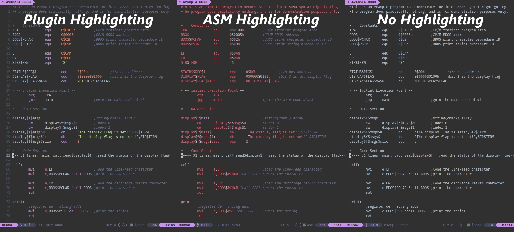

# Intel 8080 Syntax Highlighting

Adds proper syntax highlighting for intel 8080 mnemonic assembly.

___Note:___ by default, syntax highlighting is applied automatically to all
files with any of the following extensions: `8080`, `8080asm`, `i8080`, `i8080asm`.

The design of VIM's assembly highlighting was with the x86/x64 mnemonics in
mind, and as such, it doesn't work well with code written in Intel 8080
mnemonics. Though it's much more time-appropriate to use no syntax highlighting
for Intel's 8080 mnemonics, I will admit it is much nicer to work with
highlighting, and I'm confident you'll agree.



You can view individual examples here:
[Plugin Highlighting](./images/example-plugin.jpg),
[ASM Highlighting](./images/example-base-ASM.jpg),
and [No Highlighting](./images/example-syntax-off.jpg).

## Install

### Vim 8 Package Manager

Installing the plugin as a Vim 8 Package

``` bash
$ mkdir -pv ~/.vim/pack/sage-etcher/start
$ cd ~/.vim/pack/sage-etcher/start
$ git clone https://github.com/sage-etcher/vim-i8080-syntax.git
```

## Configuration

To change the default setup, you must edit the configuration variables within
your `.vimrc` file.

__Note__: All supplied code examples are written using the variables default
value(s).

An example configuration file:

``` vim-script
" true/enabled   = 1
" false/disabled = 0

" Name:    Directive Style
" Type:    String
" Values:  Value   Description/Platform
"          ------- ----------------------------------------------------------
"          CPM     CP/M's ASM Assembler
"          NONE    Don't use any non-standard definitions
let g:i8080_directive_style = 'CPM'         "Default


" Name:     Strict Number Highlighting
" Type:     Boolean
" Enabled:  No number may start with a '$'.
"           All non-decimal numbers ust start with a '0'.
" Disabled: Numbers can start with whatever.
" Example:  Value    Enabled  Disabled
"           -------- -------- ---------
"           07DH     Good     Good
"           0561Q    Good     Good
"           9AH      BAD      Good
"           $1101B   BAD      Good
let g:i8080_strict_number_formatting = 1    "Default


" Name:     Highlight Number Seperators
" Type:     Boolean
" Enabled:  0$0010$1111B
"            ^    ^
"           Highlight group is linked to the 'Special' group
" Disabled: Highlights '$' same as the rest of the digits.
let g:i8080_highlight_number_seperator = 0  "Default


" Name:     Highlight Number Type Specifier
" Type:     Boolean
" Enabled:  0$0010$1111B
"                      ^
"           Highlight group is linked the the 'Special' group
" Disabled: Highlights the number format specifier same as the rest of the
"           digits.
let g:i8080_highlight_number_seperator = 0  "Default


" Name:     PRN Syntax Highlighting
" Type:     Boolean
" Enabled:  Use the `syntax/i8080prn.vim` file for all extenstions in the
"           `i8080_prn_extensions` variable (mentioned later).
" Disabled: Don't use `i8080_prn_extensions` or the `syntax/i8080prn.vim`
            file.
let g:i8080_prn_highlighting = 1            "Default


" Name:     ASM File Extensions
" Type:     [String]
" Values:   What file extensions should the `syntax/i8080.vim` syntax file be
"           applied to?
" FileType: i8080
let g:i8080_asm_extensions = [              "Defaults
    \ 'i8080',
    \ 'i8080asm',
    \ '8080',
    \ '8080asm'
    \ ]


" Name:     PRN File Extensions
" Type:     [String]
" Values:   What file extensions should the `syntax/i8080prn.vim` syntax file
"           be applied to?
" FileType: i8080prn
let g:i8080_prn_extensions = [              "Defaults
    \ 'prn',
    \ 'PRN'
    \ ]
```

## License

This file is a part of the Intel 8080 Syntax Highlighting Vim Plugin.

Copyright 2024 Sage I. Hendricks  
Licensed under the Apache License, Version 2.0 (the "License");  
you may not use this file except in compliance with the License.  
You may obtain a copy of the License at  

&nbsp;&nbsp;&nbsp;&nbsp;<http://www.apache.org/licenses/LICENSE-2.0>  

Unless required by applicable law or agreed to in writing, software  
distributed under the License is distributed on an "AS IS" BASIS,  
WITHOUT WARRANTIES OR CONDITIONS OF ANY KIND, either express or implied.  
See the License for the specific language governing permissions and  
limitations under the License.  
