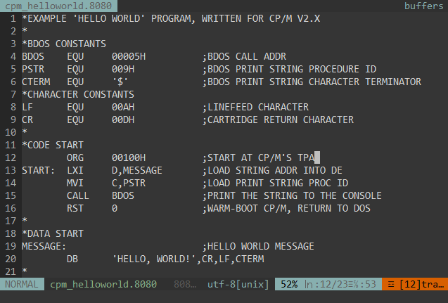
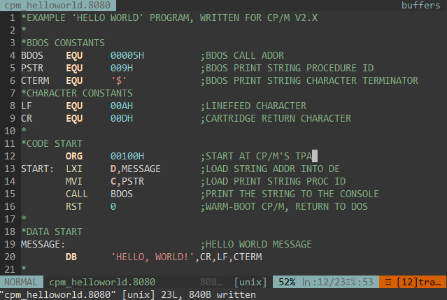
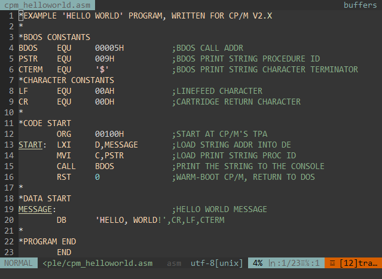

# Intel 8080 ASM Pnemonics Syntax Hightlighting

transforms 8080 assembly files from boring, plain files with no syntax hightlighting, to a wonderfully colourful, syntax highlighted file, as all code should be in this day and age!

## Install

<details>
  <summary>Vim 8 Package Manager</summary>

<br>

Install the plugin as a Vim 8 Package

`$` as user  
`#` as root  

```
$ mkdir -pv ~/.vim/pack/*/start/
$ cd ~/.vim/pack/*/start
$ git clone git@github.com:sage-etcher/vim-i8080-syntax.git

  or

$ git clone https://github.com/sage-etcher/vim-i8080-syntax.git
```

</details>


## Example

___Note:___ syntax highlighting automatically applies to all files with extension of `.8080`

<details>
  <summary>8080 extension, no plug-in</summary>

  <br>
  
  This is what 8080 pnemonic'ed code looks like without a custom syntax file.

  

</details>
<details>
  <summary>8080 extension, with plug-in</summary>

  <br>
  
  However, if instead we use the supplied custom syntaxing files, we get a much more readable, pretty, and non-eyebleed display =D

  

  Much better!

</details>
<details>
  <summary>Standard asm extension</summary>

  <br>
  
  Standard `asm` file extension also doesn't quite work, being the stock highlighting for it is based on a much more modern assembly pnemonic. Here's and example of what it looks like aswell!

  

</details>

## License

This file is a part of the intel 8080 syntax highlighting plugin  
 
Copyright 2023 Sage I. Hendricks  
 
Licensed under the Apache License, Version 2.0 (the "License");  
you may not use this file except in compliance with the License.  
You may obtain a copy of the License at  
 
&nbsp;&nbsp;&nbsp;&nbsp;<http://www.apache.org/licenses/LICENSE-2.0>  
 
Unless required by applicable law or agreed to in writing, software  
distributed under the License is distributed on an "AS IS" BASIS,  
WITHOUT WARRANTIES OR CONDITIONS OF ANY KIND, either express or implied.  
See the License for the specific language governing permissions and  
limitations under the License.  
 
